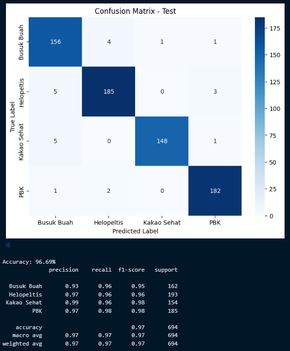
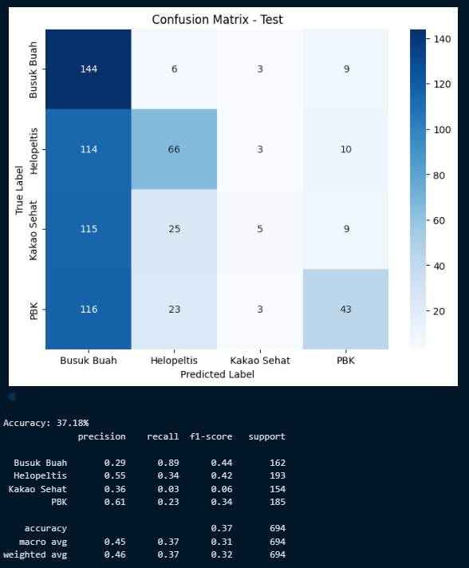
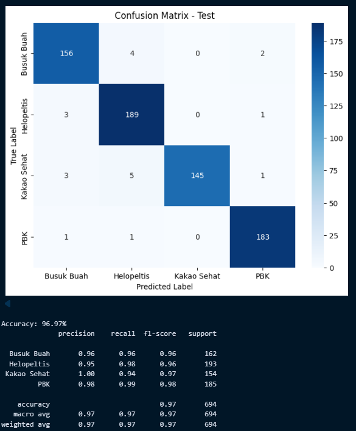

# Klasifikasi Penyakit Buah Kakao dengan ResNet50-CBAM

Implementasi penelitian **Klasifikasi Penyakit pada Buah Kakao
Menggunakan Arsitektur ResNet50-CBAM**. Notebook ini membandingkan tiga
arsitektur deep learning untuk klasifikasi citra buah kakao ke dalam
empat kelas.

## Dataset

Dataset terdiri dari **6.992 citra** yang terbagi menjadi:

  Dataset           Jumlah
  ------------ -----------
  Training           5.594
  Validation           704
  Testing              694
  **Total**      **6.992**

Kelas klasifikasi: - Busuk Buah - Helopeltis - Kakao Sehat - Penggerek
Buah Kakao

Pembagian data menggunakan proporsi sekitar **80% training, 10%
validation, dan 10% testing**.

## Pre-processing

Tahapan yang digunakan dalam notebook: 1. Dataset telah melalui proses
crop image. 2. Resize citra menjadi **224 × 224 × 3**. 3. Citra
menggunakan ruang warna RGB. 4. Normalisasi nilai piksel ke rentang
**0--1**. 5. Dataset menggunakan `label_mode="categorical"` sehingga
label digunakan dalam bentuk one-hot encoding. 6. Pipeline dataset
menggunakan `prefetch` dengan `tf.data.AUTOTUNE`.

## Model

Tiga model dibandingkan:

### 1. ResNet50

Backbone ResNet50 dengan bobot ImageNet dan `include_top=False`,
kemudian:
`GlobalAveragePooling2D → Dense(256, ReLU) → Dropout(0.5) → Dense(4, Softmax)`.

### 2. ResNet152V2

Backbone ResNet152V2 dengan bobot ImageNet dan `include_top=False`,
kemudian menggunakan classification head yang sama:
`GlobalAveragePooling2D → Dense(256, ReLU) → Dropout(0.5) → Dense(4, Softmax)`.

### 3. ResNet50-CBAM

ResNet50 yang ditambahkan **Convolutional Block Attention Module
(CBAM)** pada keluaran setiap stage: - `Conv2_x → CBAM` -
`Conv3_x → CBAM` - `Conv4_x → CBAM` - `Conv5_x → CBAM`

CBAM terdiri dari **Channel Attention** dan **Spatial Attention**.

Classification head:
`GlobalAveragePooling2D → Dense(256, ReLU) → Dropout(0.5) → Dense(4, Softmax)`.

## Konfigurasi Training

-   Optimizer: **Adam**
-   Learning rate: **1e-4**
-   Loss: **Categorical Crossentropy**
-   Metric: **Accuracy**
-   Epoch maksimum: **12**
-   Batch size: **32**
-   Early stopping: `patience=3`
-   `restore_best_weights=True`
-   Backbone pretrained dibekukan (`trainable=False`)

## Hasil Perbandingan Model

Berdasarkan hasil **testing** yang tercatat pada notebook:

| Model | Akurasi |
|---|---:|
| ResNet50 | 96.69% |
| ResNet152V2 | 37.18% |
| ResNet50-CBAM | **96.97%** |

### Hasil Testing ResNet50



### Hasil Testing ResNet152V2



### Hasil Testing ResNet50-CBAM



## Evaluasi

Evaluasi model dilakukan menggunakan: - Accuracy - Confusion Matrix -
Classification Report - Precision - Recall - F1-score

## Grad-CAM

Model terbaik divisualisasikan menggunakan **Grad-CAM** untuk melihat
area citra yang menjadi perhatian model.

Pada ResNet50-CBAM, visualisasi dilakukan pada keluaran: -
`conv2_block3_out` - `conv3_block4_out` - `conv4_block6_out` -
`conv5_block3_out`

Tujuannya untuk melihat perubahan fokus fitur model dari stage awal
hingga stage akhir.

## Struktur Singkat Penelitian

``` text
Dataset
   ↓
Pre-processing
   ├── Crop Image
   ├── Resize 224×224×3
   ├── RGB
   └── Normalization
   ↓
Split Dataset
   ├── Train 80%
   ├── Validation 10%
   └── Test 10%
   ↓
Training
   ├── ResNet50
   ├── ResNet152V2
   └── ResNet50-CBAM
   ↓
Evaluasi
   ├── Accuracy
   ├── Confusion Matrix
   └── Classification Report
   ↓
Best Model Selection
   ↓
Grad-CAM
```

## Output Model

Model ResNet50-CBAM disimpan dalam format:

``` text
model_resnet50_cbam.h5
model_resnet50_cbam.keras
```
